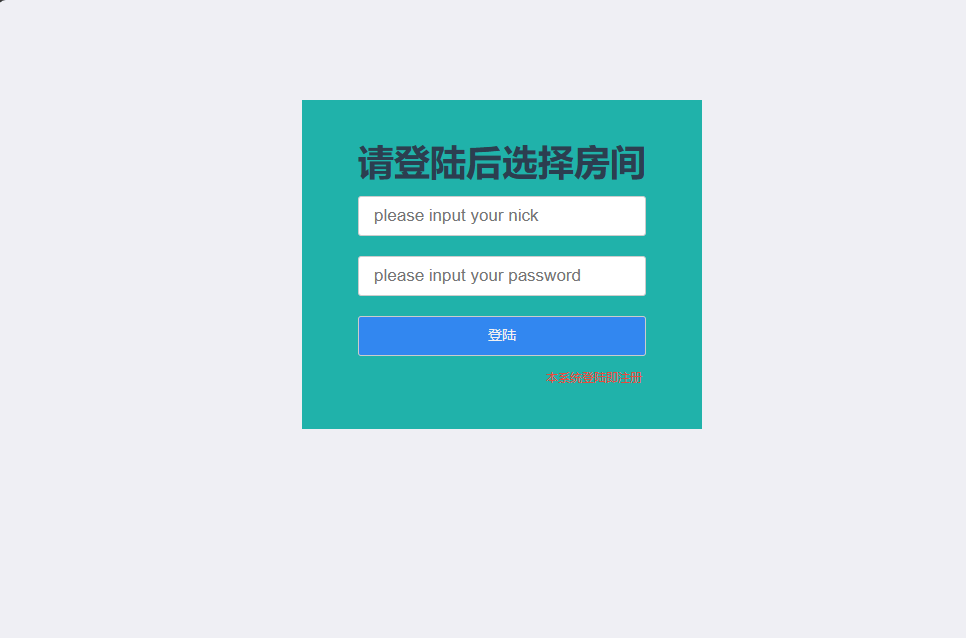
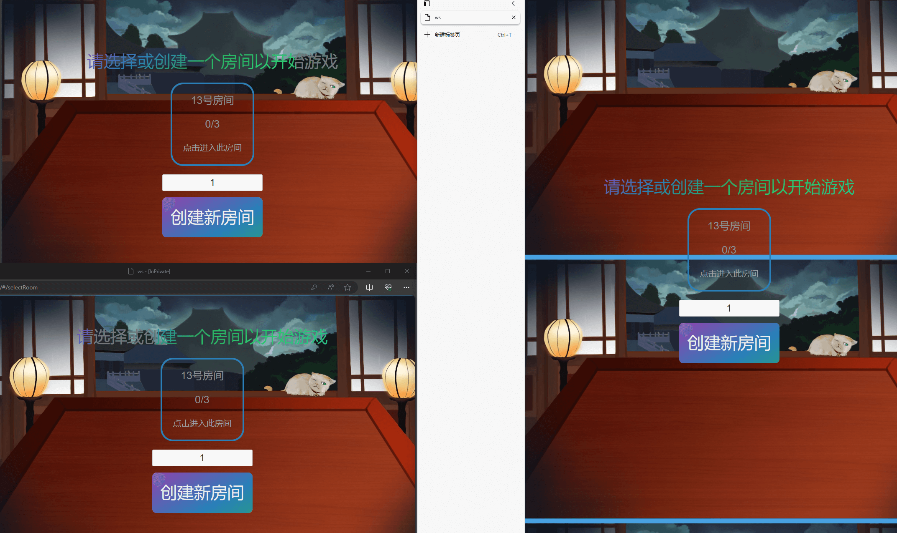
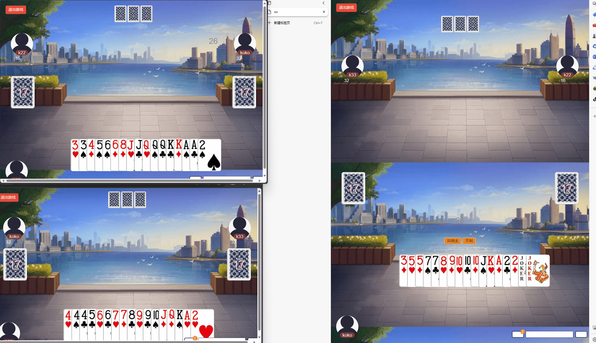
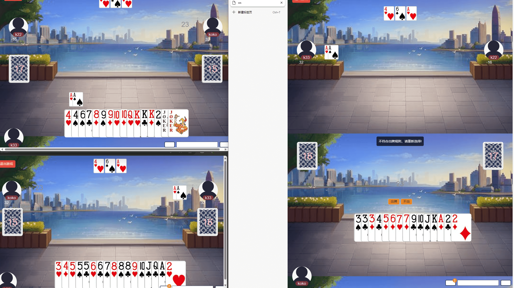
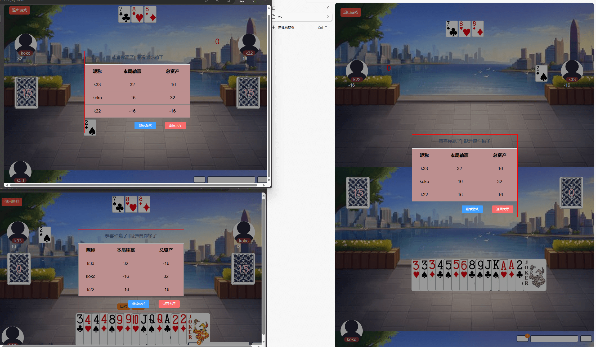

# 毕业设计项目_斗地主

#### 介绍
钟柯的毕设仓库
题目:基于JavaScript的网络游戏

#### 软件架构
软件架构说明

#### 安装教程

1. git clone https://github.com/wp3527kcc/doudizhu
2. git clone https://gitee.com/wp3527kcc/graduation_project

#### 环境要求
1. nodejs环境
2. mysql

#### 使用说明

1.  使用server/demo.sql建表，修改 server/public/js/method.js 中 mysql.createConnection相关配置
2.  cd client & npm install & npm run dev
2.  cd server & npm install & node app.js
3.  使用浏览器打开三个http://localhost:8000 后进行登陆操作，创建房间或进入房间后即可开始游戏

#### 参与贡献

1.  Fork 本仓库
2.  新建 Feat_xxx 分支
3.  提交代码
4.  新建 Pull Request

#### 游戏画面截图
## 进入房间，用户登录即注册，后台会将用户账号信息写入数据库user表中，后续用于统计用户成绩

## 已存在房间时用户可选择游戏房间进入游戏，也可自行创建房间等待其他玩家的加入

## 叫地主阶段，三个用户轮流叫地主，如果都不叫则重新发牌。

## 用户出牌，系统具有判断是否大于上家牌，不大时会阻止用户非法出牌

## 一场游戏结束后弹出弹窗结算画面，用户可选择继续在此房间游戏，或者回到大厅
